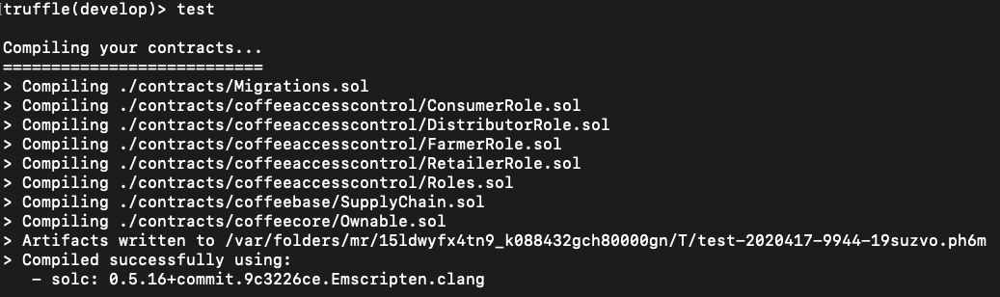
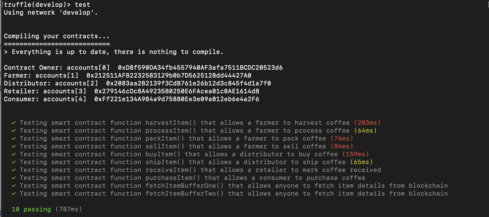
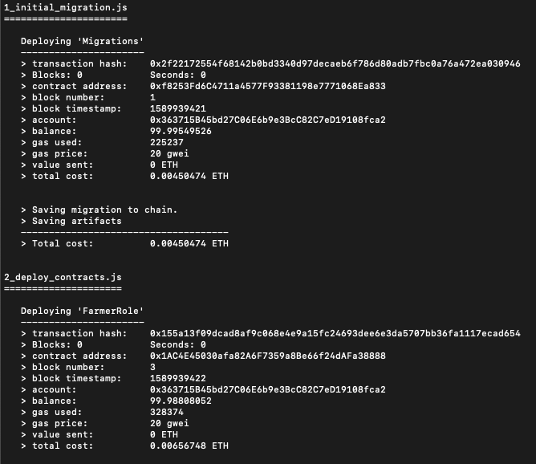
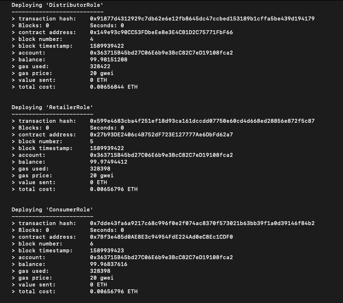
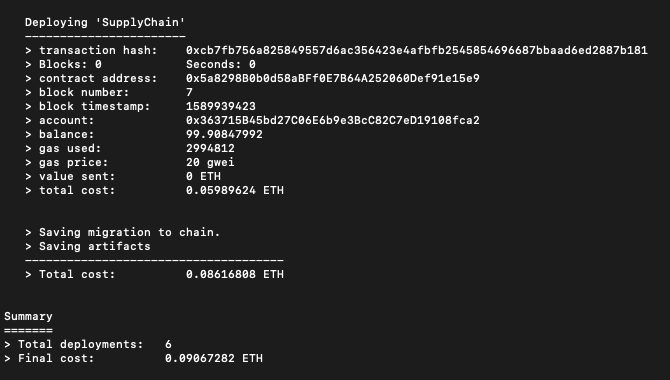

# Ethereum DApp for Tracking Items Through the Supply Chain

I created a DApp supply chain solution to prove the authenticity of coffee by leveraging the transparency, traceability and efficiency of the Ethereum blockchain network. I built smart contracts that manage specific user permission controls as well as contracts that track and verify a product’s authenticity.

___

# Part 1: Plan the Project With Write-Ups

## Requirement 1: UML Architecture Diagrams (Project Write-Up)

- **[Activity Diagram](./architecture/UML-Diagrams-Activity-Diagram.png):** Flow of one activity to another in the system. Captures dynamic behavior of the system.

- **[Sequence Diagram](./architecture/UML-Diagrams-Sequence-Diagram.png):** Integration between objects in the sequence in which they take place.

- **[State Diagram](./architecture/UML-Diagrams-State-Diagram.png):** Shows changes from one state to another and usually depicts the creation state and final states if there are any.

- **[Classes Diagram (Data Model)](./architecture/UML-Diagrams-Class-(Data-Modeling).png):** A structure that represents the components of a systems by illustrating the system's classes, attributes, operations, and how the objects may be connected.

- For Practice to warm-up: [LucidChart tutorial on ATM transactions with a bank](./architecture/Practice-Sequence-Diagram-Example-(LucidChart).png) based on this [LucidChart video tutorial](https://www.youtube.com/watch?v=pCK6prSq8aw)

## Requirement 2: Project Write-up - Libraries

### Programming Libraries Used:
- **Truffle v5.1.14-nodeLTS.0 (core: 5.1.13):** used in project to deploy, test, and deploy DApp's smart contracts.
- **Solidity v0.5.16 (solc-js):** an object-oriented, high-level langauge for writing, designing, and implementing smart contracts.
- **OpenZeppelin v2.1.2:** minimizes risk by using battle-tested libraries of smart contracts. 
- **Node v12.16.2:** used for easily building fast and scalable network applications - integral for deploying UI to the browswer.
- **Web3.js v1.2.1:** used to allow the DApp to interact with a local/remote Ethereum node with an HTTP, HTTPS, or IPC connection.

### Technologies used:
- **Ganache:** used to develop, deploy, and test the DApp in a safe and deterministic environment before deploying.
- **Visual Studio Code:** IDE
- **Infura:** used to run the application without needing to set up an Ethereum node or wallet by using a hosted Ethereum node cluster.
- **Diagrams.net:** used to design the UML diagrams and DAPP/blockchain architecture before building.

### Resources Used:
- [LucidChart: UML Activity Diagram Tutorial](https://www.lucidchart.com/pages/uml-activity-diagram)

- [LucidChart: Guide to Drawing a Sequence Diagram in UML](https://www.lucidchart.com/pages/how-to-draw-a-sequence-diagram-in-UML?a=1)

- [LucidChart Video: How to Make a UML Sequence Diagram](https://www.youtube.com/watch?v=pCK6prSq8aw)

- [LucidChart: UML Class Diagram Tutorial](https://www.lucidchart.com/pages/uml-class-diagram)

- [LucidChart Video: UML Class Diagram Tutorial](https://www.youtube.com/watch?v=UI6lqHOVHic)

- [LucidChart: How to Draw a State Machine Diagram in UML](https://www.lucidchart.com/pages/how-to-draw-a-state-machine-diagram-in-uml)

- [BitDegree: Local and State Solidity Variables and Use of Parameters](https://www.bitdegree.org/learn/solidity-variables)

## Requirement 3: General Write Up

### Contracts Address:**
1. **Deploying 'Migrations'**
[0xf8253Fd6C4711a4577F93381198e7771068Ea833](https://etherscan.io/address/0xf8253Fd6C4711a4577F93381198e7771068Ea833)

2. **Deploying Contracts:**
FarmerRole:
[0x1AC4E45030afa82A6F7359a8Be66f24dAFa38888](https://etherscan.io/address/0x1AC4E45030afa82A6F7359a8Be66f24dAFa38888)

DistributorRole:
[0x149e93c90CC53FDbeEe8e3E4CB1D2C75771FbF66](https://etherscan.io/address/0x149e93c90CC53FDbeEe8e3E4CB1D2C75771FbF66)

RetailerRole:
[0x27b93DE2406c4B752dF723E127777Ae6DbFd62a7](https://etherscan.io/address/0x27b93DE2406c4B752dF723E127777Ae6DbFd62a7)

ConsumerRole:
[0x7Bf3e485d0AE8E3c94954FdE224Ad0eC8Ec1CDF0](https://etherscan.io/address/0x7Bf3e485d0AE8E3c94954FdE224Ad0eC8Ec1CDF0)

SupplyChain:
[0x5a8298B0b0d58aBFf0E7B64A252060Def91e15e9](https://etherscan.io/address/0x5a8298B0b0d58aBFf0E7B64A252060Def91e15e9)

### Deploying Contracts Terminal Window:**

   1_initial_migration.js
   ======================

   Deploying 'Migrations'
   ----------------------
   > transaction hash:    0xe6451251a99f026b01f015106f4f296e031915de5bfc6171986e44cadcdc45d1
   > Blocks: 0            Seconds: 0
   > contract address:    0xFEeCfF2CB7d6f3BfcBE5fa41c49c8fB642f2dDbF
   > block number:        1
   > block timestamp:     1590021885
   > account:             0x27D8D15CbC94527cAdf5eC14B69519aE23288B95
   > balance:             99.99549526
   > gas used:            225237
   > gas price:           20 gwei
   > value sent:          0 ETH
   > total cost:          0.00450474 ETH

   > Saving migration to chain.
   > Saving artifacts
   -------------------------------------
   > Total cost:          0.00450474 ETH

   2_deploy_contracts.js
   =====================

   Deploying 'FarmerRole'
   ----------------------
   > transaction hash:    0x4bb15fb37990703b89a667c0237542cfa9d5865f421d928d97a80f9b96cb41bc
   > Blocks: 0            Seconds: 0
   > contract address:    0xf2ee0b0Cdcae5013930B92c0Ba54F7F7f1933613
   > block number:        3
   > block timestamp:     1590021886
   > account:             0x27D8D15CbC94527cAdf5eC14B69519aE23288B95
   > balance:             99.98808052
   > gas used:            328374
   > gas price:           20 gwei
   > value sent:          0 ETH
   > total cost:          0.00656748 ETH

   Deploying 'DistributorRole'
   ---------------------------
   > transaction hash:    0x3cfb5242e9e9159052c6d62dfc900a9af45822ab39f604df3984f1fc04da07ae
   > Blocks: 0            Seconds: 0
   > contract address:    0xd22De155853B67cE1cA3693FBE52EE958f755E7b
   > block number:        4
   > block timestamp:     1590021886
   > account:             0x27D8D15CbC94527cAdf5eC14B69519aE23288B95
   > balance:             99.98151208
   > gas used:            328422
   > gas price:           20 gwei
   > value sent:          0 ETH
   > total cost:          0.00656844 ETH

   Deploying 'RetailerRole'
   ------------------------
   > transaction hash:    0xb4433ecfcb0ff7bc84128d864b60de85da64f970d56741e12989c1719971c2f4
   > Blocks: 0            Seconds: 0
   > contract address:    0x79051A2faFcC216A55d3897474012145d158F170
   > block number:        5
   > block timestamp:     1590021886
   > account:             0x27D8D15CbC94527cAdf5eC14B69519aE23288B95
   > balance:             99.97494412
   > gas used:            328398
   > gas price:           20 gwei
   > value sent:          0 ETH
   > total cost:          0.00656796 ETH

   Deploying 'ConsumerRole'
   ------------------------
   > transaction hash:    0xe299f9df182e617e29f682abd9d508c4d45a814736473c83d8698cd1e074e1d6
   > Blocks: 0            Seconds: 0
   > contract address:    0xA65B87754E0A73860AA6B7eb6E95D79CD2d893d2
   > block number:        6
   > block timestamp:     1590021886
   > account:             0x27D8D15CbC94527cAdf5eC14B69519aE23288B95
   > balance:             99.96837616
   > gas used:            328398
   > gas price:           20 gwei
   > value sent:          0 ETH
   > total cost:          0.00656796 ETH

   Deploying 'SupplyChain'
   -----------------------
   > transaction hash:    0xe61293a6580a2ffb2dd0706825ef960eded8f342702979d801b4c1886274a5e0
   > Blocks: 0            Seconds: 0
   > contract address:    0x23E2b13b08a22E9eEe431F862eC7A17aB1E99B98
   > block number:        7
   > block timestamp:     1590021886
   > account:             0x27D8D15CbC94527cAdf5eC14B69519aE23288B95
   > balance:             99.90847992
   > gas used:            2994812
   > gas price:           20 gwei
   > value sent:          0 ETH
   > total cost:          0.05989624 ETH

   > Saving migration to chain.
   > Saving artifacts
   -------------------------------------
   > Total cost:          0.08616808 ETH

   Summary
   =======
   > Total deployments:   6
   > Final cost:          0.09067282 ETH

### Steps Used:

### **Architecture**
- Used [Diagrams.net](https://app.diagrams.net/) for construction of UML diagrams because [LucidChart](https://www.lucidchart.com/) only allowed me to use 60 items on the free plan 🙃

### **Dependencies**
- Verify the latest Truffle version (v5.1.13) is installed with `truffle -version`, or if not, use the command to do so: `npm install -g truffle`
- Run the command: `truffle init` to initialize a truffle project.
- Run `npm install --save truffle-hdwallet-provider` used to set up the provider to connect to the Infura Node
- Run `npm install openzeppelin-solidity`
- Run `npm install web3`

___

# Part 2: Write Smart Contracts

## Requirement 1: Define and Required Implement Interfaces

**Necessary Updates**
- Updated all smart contracts with `>=` instead of `^` where applicable for each `pragma solidity ^0.4.24` statement at the top. See: [contracts](./contracts).

## Requirement 2: Build Out `AccessControl` Contracts

**AccessControl:** Collection of Contracts: These contracts manages the various addresses and constraints for operations that can be executed only by specific roles.

- The files in `[coffeeaccesscontrol](./contracts/coffeeaccesscontrol)` control access control for each actor:
    1. Farmer: The Farmer can harvest coffee beans, process coffee beans, pack coffee palettes, add coffee palettes, ship coffee palettes, and track authenticity.
    2. Distributor: The Distributor can buy coffee palettes and track authenticity.
        - NOTE: Manufacturers (i.e. UML diagrams) and distributors (smart contracts/codebase) are used interchangeably.
    3. Retailer: The Retailer can receive coffee palettes and track authenticity.
        - NOTE: Grocery Stores (i.e. UML diagrams) and retailers (smart contracts/codebase) are used interchangeably.
    4. Consumer: The consumer can buy coffee palettes and track authenticity.

**Objective:** build out these contracts so that each actor’s role in the supply chain is distinct with no overlap in their access abilities.

## Requirement 3: Build Out `Base` Contract

**Base:** SupplyChain.sol: This is where we define the most fundamental code shared throughout the core functionality. This includes our main data storage, constants and data types, plus internal functions for managing these items.

The file in `[coffeeaccesscontrol](./contracts/coffeebase)`  called `[SupplyChain.sol](./contracts/SupplyChain.sol)` holds all common structs, events and base variables:
- Product ID
- Product UPC
- Origination Information
- Origin Actor (e.g. Farmer ID, Farmer Name, )
- Misc. organization information (e.g. Farmer Information)
- Misc. organization information (e.g. Farmer Information)
- Longitude and Latitude of Origin Coordinates (e.g. Farm’s 
- Longitude and Latitude)
- Product notes
- Product price

## Requirement 4: Build Out `Core` Contract

**Core:** Ownable.sol: is the contract that controls ownership and transfer of ownership.

- Defined `contract SupplyChain` for: `ConsumerRole`, `DistributorRole`, `FarmerRole`, and `RetailerRole`
    - These are the four actors in the supply chain we care about and want to build relationships between.

**Contracts all compile successfully:**

___

# Part 3: Test smart contract code coverage

Implemented a set of 10 function tests for: 
- `harvestItem()`
- `processItem()`
- `packItem()`
- `addItem()`
- `buyItem()`
- `shiptItem()`
- `receiveItem()`
- `purchaseItem()`
- `fetchItemBufferOne()`
- `fetchItemBufferTwo()`

**All 10 tests pass successfully:**

___

# Part 4: Deploy smart contracts on a public test network (Rinkeby)

### **Deploy in Ganache**
- Open Ganache in-app
- Run in the terminal: `ganache-cli -m "SEED FROM THE .Secret FILE"`
- In a separate terminal window, run: `truffle compile`
    - This will create the smart contract artifacts in folder `build\contracts`.
- Run: `truffle migrate`
    - This migrates the smart contracts to the locally running blockchain, ganache-cli
- Test the smart contracts by running: `truffle test`
- In a separate terminal window, run: `npm i` to install the dependecies.
- Then, run: `npm run dev`

### **Running a local Ethereum network and deploying to the local network**
- Open a Terminal window, and cd into project directory
- Run command `truffle develop` (to run a local ethereum network)
- Use command `compile` (to compile your solidity contract files)
- Use command `migrate --reset` (to deploy your contract to the locally running ethereum network)

### **Deploying to the Rinkeby Ethereum testnet using Truffle**
- Terminal command to deploy to Rinkeby using truffle: `truffle migrate --reset --network rinkeby`

# Migrations Output in the Terminal:

